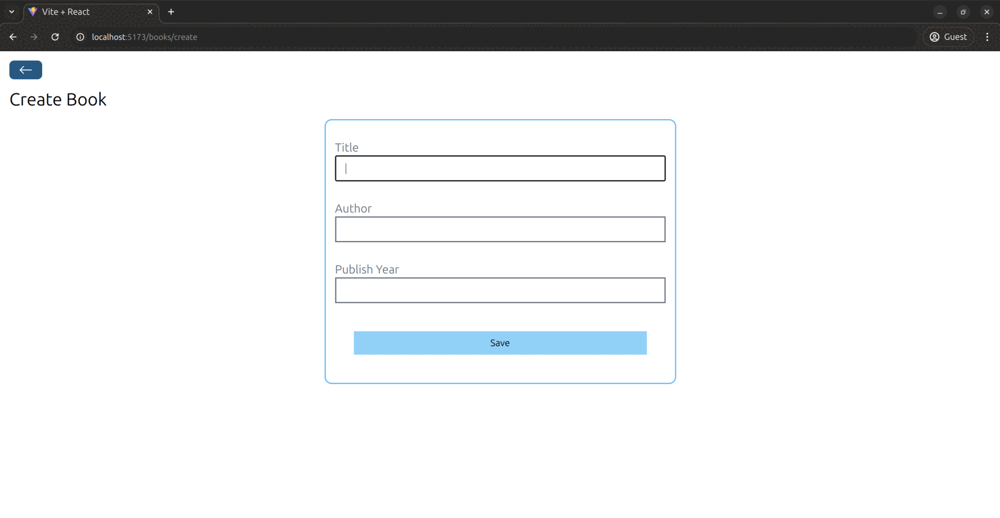

# Book Store Management System

This is a full-stack MERN (MongoDB, Express.js, React, Node.js) application for managing a collection of books.

### Overview


## Features

### Backend Features
- RESTful API built with Express.js
- MongoDB database integration using Mongoose
- CRUD operations for books:
  - Create new books
  - Retrieve all books
  - Retrieve single book by ID
  - Update book details
  - Delete books
- Data validation for book entries
- CORS enabled for frontend integration

### Frontend Features
- Modern React.js application built with Vite
- Responsive design with Tailwind CSS
- Two view modes: Table and Card views
- Complete CRUD operations interface
- Real-time updates using Axios for API communication
- Client-side routing with React Router
- Modern UI with React Icons
- Notification system using Notistack

## Tech Stack

### Backend
- Node.js
- Express.js
- MongoDB
- Mongoose
- CORS

### Frontend
- React.js
- Vite
- Tailwind CSS
- Axios
- React Router DOM
- React Icons
- Notistack

## Setup Instructions

### Backend Setup
1. Navigate to the backend directory:
   ```bash
   cd backend
   ```
2. Install dependencies:
   ```bash
   npm install
   ```
3. Create a `config.js` file with your MongoDB connection URL and port
4. Start the development server:
   ```bash
   npm run dev
   ```
The backend server will start on port 5555.

### Frontend Setup
1. Navigate to the frontend directory:
   ```bash
   cd frontend
   ```
2. Install dependencies:
   ```bash
   npm install
   ```
3. Start the development server:
   ```bash
   npm run dev
   ```
The frontend development server will start on port 5173.

## Architecture

### Backend Architecture
- `index.js`: Main server file with Express configuration and middleware setup
- `models/`: Contains Mongoose schemas
  - `bookModel.js`: Defines the book schema with title, author, and publishYear
- `routes/`: API route definitions
  - `booksRoute.js`: Handles all book-related API endpoints

### Frontend Architecture
- `src/`: Main source directory
  - `App.jsx`: Main component with route definitions
  - `pages/`: Page components
    - `Home.jsx`: Main books listing page
    - `CreateBook.jsx`: Book creation form
    - `ShowBook.jsx`: Book details view
    - `EditBook.jsx`: Book editing form
    - `DeleteBook.jsx`: Book deletion confirmation
  - `components/`: Reusable UI components
    - `Spinner.jsx`: Loading indicator
    - `BooksTable.jsx`: Table view for books
    - `BooksCard.jsx`: Card view for books

## API Endpoints

- GET `/books`: Retrieve all books
- GET `/books/:id`: Retrieve a specific book
- POST `/books`: Create a new book
- PUT `/books/:id`: Update a book
- DELETE `/books/:id`: Delete a book

## Data Model

Book Schema:
```javascript
{
  title: String (required),
  author: String (required),
  publishYear: Number (required),
  timestamps: true
}
```